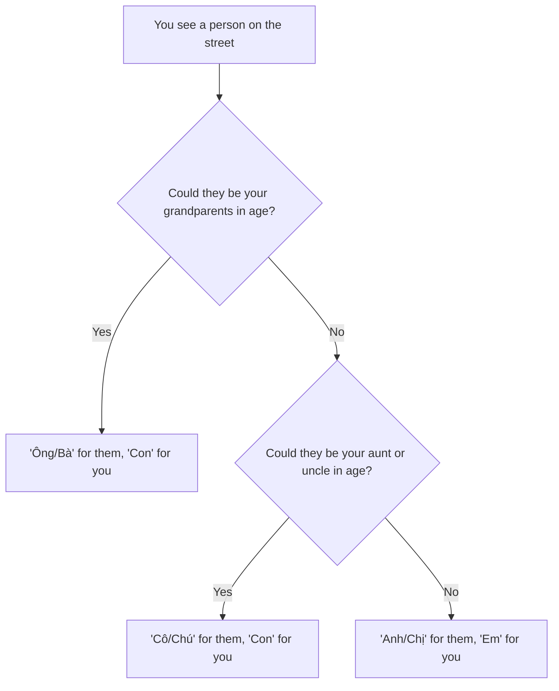

# Common pronouns

This section contains:
* [Cultural background](#cultural-background)
* [Common pronouns](#common-pronouns)
* [What about my partner's parents?](#what-about-my-partners-parents)
* [How to select a pronoun?](#how-to-select-a-pronoun)
* [Pronunciations](#pronunciations)

## Cultural background

In Vietnamese daily conversations, an important first step is picking the appropriate pronouns to use with your conversational partner. Why? Because Vietnamese pronouns are linked to the ages of speaking partners relative to each other.

Therefore, unlike the English "you" and "I", in Vietnamese, a person can have different pronouns, depending on who they're talking to.

> [!NOTE]
> **Tidbit:**
> As you age, the pronouns people pick to refer to you will also be different!

## Common pronouns

This section will present the most commonly-used pronouns. For pronunciations, see [pronunciations](#pronunciations)

| Pronouns | Literal translation | Usage                                                                                                                           | 
|----------|---------------------|---------------------------------------------------------------------------------------------------------------------------------|
| Anh      | Older brother       | Refer to yourself as an older brother Refer to someone else who can be your older brother in age                                |
| Chị      | Older sister        | Same as "anh"                                                                                                                   |
| Em       | Younger person      | Counterpart of "anh"/"chị": When referring to yourself as "anh"/"chị", you should refer to your partner as "em", and vice versa |
| Chú      | Uncle               | Similar to "anh", but for someone who can be your uncle in age                                                                  |
| Cô       | Auntie              | Same as "chị", but for someone who can be your aunt in age                                                                      |
| Ông      | Grandpa             | Similar to "anh", but for someone who can be your grandpa in age                                                                |
| Bà       | Grandma             | Similar to "chị", but for someone who can be your grandma in age                                                                |
| Con      | Much younger person | Similar to "em": This is the counterpart for "ông", "bà", "cô", "chú"                                                           |

All the pronouns above can also be used in its literal sense: "anh" for your actual older brother, "chị" for your actual older sister, and so on.

 We mentioned before that pronouns can change depend on who you're talking to. Let's look at an example:

* You see a middle-aged lady on the street, she's likely 10-20 years than you -> "cô" for the other & "con" for you
* You _are_ the middle-aged lady on the street, someone 10-20 years younger than you approaches -> "con" for the other & "cô" for you 

> [!TIP]
> **Tip:** 
> When in doubt, pick the younger pronouns. You want to avoid implying that the other person is too old. This could, in some cases, be unpleasant to the receiver.

## What about my partner's parents?

If you're not married to your partner (e.g. dating, engaged), 'Cô/Chú' for them, 'Con' for you.

If you are married:

| Pronouns | Literal translation | Usage                                                                                                                           | 
|----------|---------------------|---------------------------------------------------------------------------------------------------------------------------------|
| Ba       | Dad                 | Refer to your father-in-law                                                                                                     |
| Mẹ       | Mom                 | Refer to your mother-in-law                                                                                                     |
| Con      | Much younger person | Refer to yourself. This one is also the counterpart of "ba" and "mẹ".                                                           |

## How to select a pronoun?

## Pronunciations

| Word     | Audio                                           | 
|----------|-------------------------------------------------|
| Anh      |  |
| Chị      |  |
| Em       |  |
| Chú      |  |
| Cô       |  |
| Ông      |  |
| Bà       |  |
| Con      |  |
| Ba       |  |
| Mẹ       |  |